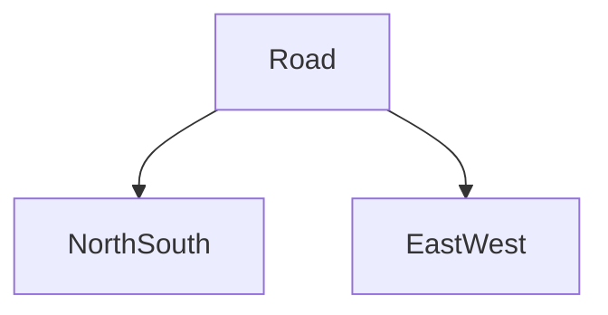

# FSM-Based-Traffic-Light-Controller

## AIM 
To design and simulate a Traffic Light Controller using Verilog HDL and Finite State Machine (FSM) methodology, ensuring precise timing control for traffic signals in a two-way intersection.

## PROBLEM STATEMENT 
In real-world traffic systems, signal lights must follow a strict sequence of Green → Yellow → Red to ensure the safe flow of vehicles. A traffic controller should:

- Provide accurate timing for each signal state.

- Avoid conflicts (e.g., both roads are green simultaneously).

- Be easily extendable for more lanes or adaptive systems.

The challenge is to implement this logic in hardware description language (HDL) so it can be synthesized on an FPGA or simulated in EDA tools.

## METHODOLOGY 
- Two roads have been evaluated, each governed by a traffic signal at the intersection.

- This has been implemented as a finite state machine (FSM) with 4 states.
- Each state here corresponds to some combination of the lights for the signals on both roads.
- A counter keeps track of how long the system must stay in a state.
- The transitions from one state to another occur based on the duration that has been defined.

### State table of the system

### State transition diagram of the system

The states have been defined as follows  : 
- S0 = 00 (Signal1_light is GREEN Signal2_light is RED)
- S1 = 01 (Signal1_light is YELLOW Signal2_light is RED)
- S2 = 10 (Signal1_light is RED Signal2_light is GREEN)
- S3 = 11 (Signal1_light is RED Signal2_light is YELLOW)

## Results and Waveforms 
### Console output 

### Waveforms 

From the waveforms, the following can be analyzed :
- Green lasts exactly 50 ns.
- Yellow lasts exactly 20 ns.
- If a don't care state occurs, the present state will be S0, i.e signal1_light =GREEN and signal2_light=RED
- This cycle repeats until the time of 520s as shown in the waveform.

## Conclusions 
- A working FSM-based traffic light controller was successfully designed and verified using Verilog HDL.
- The design demonstrates correct signal sequencing and accurate timing.
- The FSM approach ensures modularity and scalability for larger intersections.

## Future Scope
- Add pedestrian crossing signals with push-button integration.
- Implement adaptive timing using traffic sensors.
- Extend to multi-lane or four-way intersections.
- Deploy on FPGA hardware for real-time demonstration.
- Integrate with IoT or AI systems for smart city applications.

